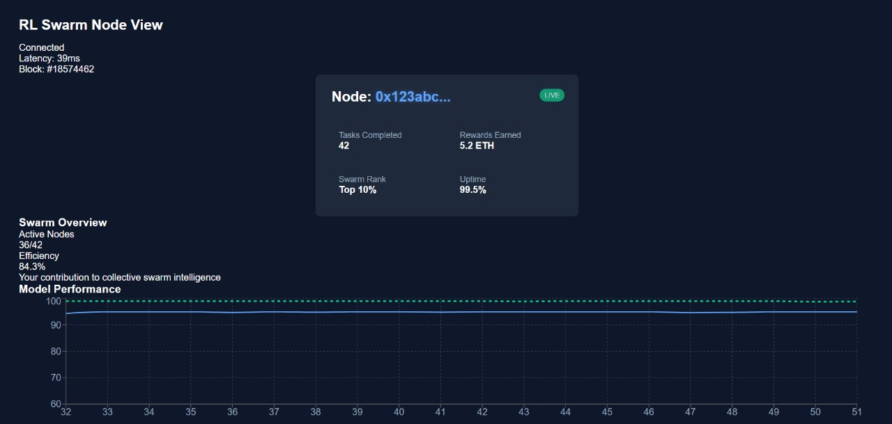

# RL Swarm Node View Dashboard



## 🚀 About The Project
RL Swarm Node View is an alternative dashboard that visualizes how reinforcement learning models train more effectively when part of a collective swarm. This dashboard was created for the RL Swarm UI Hackathon sponsored by Gensyn.

The dashboard provides unique insights into:
- Individual node performance metrics
- Swarm-wide collective intelligence
- Comparative analysis of models across different swarms
- Real-time tracking of rewards and performance over time

## ✨ Key Features

- **Node Status Card**: View your node's key metrics including tasks completed, rewards earned, swarm rank, and uptime
- **Network Status Indicator**: Real-time connection status with latency and block information
- **Swarm Overview**: Visualize your node's contribution to the collective swarm across different categories
- **Performance Charting**: Track tasks completed and other metrics over customizable time periods
- **Rewards Tracking**: Monitor ETH rewards earned over time with adjustable time ranges
- **Model Comparison**: Compare individual model performance against collective swarm intelligence
- **Swarm Performance Metrics**: Detailed metrics comparing your node against swarm averages

## 🔍 Research Focus

This dashboard visualizes the core findings of Gensyn's research:

> We find that models training with RL learn faster when they train as a collective swarm than they do on their own.

The visualizations highlight how decentralized ML parameters distributed across devices lead to faster learning and better model performance through collective swarm intelligence.

## 🖥️ Technologies Used

- React.js for UI components
- Recharts for data visualization
- Tailwind CSS for styling
- Vite for fast development and bundling

## 🏃‍♂️ How to Run

1. Clone the repository
```
git clone https://github.com/yourusername/ego-view-dashboard.git
cd ego-view-dashboard
```

2. Install dependencies
```
npm install
```

3. Start the development server
```
npm run dev
```

4. Open your browser and navigate to `http://localhost:3000`

## 📊 Dashboard Components

### Node Card
Displays your node's key metrics and status, including the unique node ID, tasks completed, rewards earned, swarm rank, and uptime percentage.

### Swarm Overview
Shows active node count, swarm efficiency, and your node's contribution to the collective intelligence using a radar chart visualization.

### Performance Charts
Track node performance over time with customizable time ranges (7D, 14D, 30D, ALL). The area charts visualize both tasks completed and rewards earned.

### Model Comparison
This critical visualization demonstrates how models perform across different swarms compared to collective swarm intelligence. The dashed green line shows the power of collective training, consistently outperforming individual models.

### Swarm Performance Metrics
Tabbed interface with three views:
- Performance Comparison: Compare your node against swarm averages
- Node Contribution: Radar chart of your contribution categories
- Swarm Stats: Overall health metrics of the collective

## 💡 Design Philosophy

The dashboard was designed with these principles in mind:
- Highlight the advantages of collective swarm training over individual approaches
- Provide both high-level overviews and detailed metrics in a clean interface
- Use color and visual hierarchy to communicate insights at a glance
- Deliver real-time updates to show the dynamic nature of swarm training

## 🔮 Future Enhancements

- Add historical performance data storage and retrieval
- Implement node-to-node communication visualization
- Create swarm topology mapping
- Add alerting for anomalous node behavior
- Develop predictive analysis for rewards forecasting

---

Created by [Your Name] for the RL Swarm UI Hackathon.